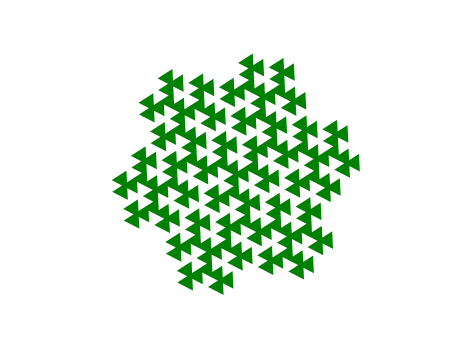

# GosperChristmasTree
3D Christmas tree  design based on Gosper Dragon fractal

# Idea 
Make a Christmas tree from succesive iterations of Gosper Hexagon.




# Progress
I tried to scale the shape to a point first, but the edges got so close that it could not be sliced correctly in vase mode.


# Vase mode plan
Since the Gosper dragon curves in on itself, it cannot be extruded and intersected with a cone.

## Triangulate from the center
- All of the path edges will be part of the boundary.
- Start with the interior triangle. The triangulations down each arm shouls be identical.
- The center interior edge will be the "frontier". Add new triangles are form with an edge from the frontier.
- For every edge on the frontier, find the closest vertex such that the triangle with the edge doesn't cross any edges.
- Add the triangle to the triangulation.
- If an edge is on the boundary, remove it from the boundary set. Otherwise, add the edge to the frontier.
- Repeat until the boundary is exhausted.

## Computing the Z coordinate
- Starting with the initial edge find the minimal path length along the triangle edges in the triangulation to each vertex.
- The greater the distance the lower the Z-coordinate.
- The bottom is the entire curve set a Z-height zero.

# Dependencies
Listed in `requirements.txt`. Install using:
```
pip install -r requirements.txt
```
